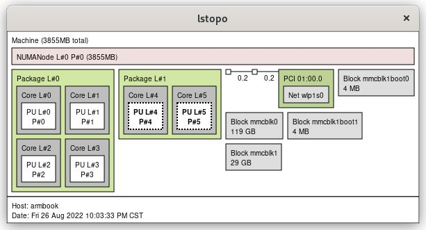
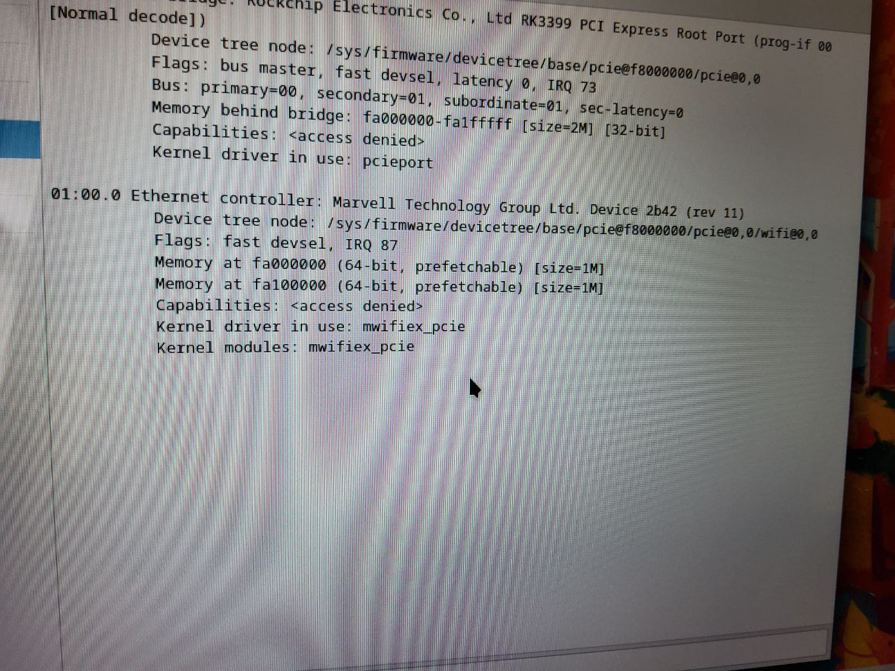

受到Apple M1的持久续航的启发， 想到会不会Arm的laptop的续航会比较可观\
开始着手搜寻各种arm构架的laptop

可选项有如下几个:
- 之前听闻华为擎云L410,但是~~过于灵车~~,而且价格超出预算\
- 马上要来的Thinkpad x13s看上去非常诱人, 但是售价也是非常的感人\
- 开源社区的Pinebook Pro看起来很合适, 无奈大陆购买比较困难\
- 各种型号的Chromebook, 价格低廉, ~~做工精美~~, 就是它了

在逛某鱼的时候发现有ASUS C100P这样一台RK3288的本本, 去查了一下发现它出现在了ArchLinuxArm的硬件支持列表上面
顺着这个路线, 我又找到了它的继任型号C101P, 使用RK3399，在今天还可堪一用

最终使用480CNY购入了一台橙色很新的C101P

到手之后，键盘里面几乎没有灰尘, 屏幕和外壳上面没有划痕，nice\
但是10.1寸的屏幕拿来日常用比较费力，而且分辨率只有1280x720(后面出掉也主要是这个原因)

ChromeOS的原生应用运行十分流畅，不过这些功能都是使用Chrome的web端\
720p的视频解码它还可以对付，但是1080P以上的卡顿的几乎完全不能忍

ChromeOS提供的LInux环境是使用容器实现的,所以性能十分垃圾，只是使用命令行打开ranger文件管理器就要等待30seconds\
这样的性能显然不是RK3399应有的水平, 开始动了换掉ChromeOS的想法

找到ArchLinuxArm的[文档](https://archlinuxarm.org/platforms/armv8/rockchip/asus-chromebook-flip-c101pa#installation), 发现可以通过启动外置系统的方式来把Arch装进sdcard里面\
成功装进去之后大概是酱紫的:

能看到我给KDE装了一个漂亮的主题，同时还开了一点东西，\
这些能在这一台10.1寸的小本本上面完成在我看来是非常awesome的

它的续航果然还不错，虽然电池只有30+Wh, 但是它的峰值功耗也只有6Watt, 轻度使用大概能有6hr的续航

键盘的体验很熟悉，很像是我接触到的第一台laptop(它也是ASUS) 这样的键程对于10.1寸的laptop来说已经算是很棒了

RK3399可以使用主线内核，这个本本的硬件信息如下图\

下面就到了折腾时间\
这台Chromebook C101P 的网卡是诡异的Marvell,需要额外的firmware才能工作\

archlinuxarm的包维护状况似乎不太好，fcitx5-rime的整套东西都是炸的\

睡眠则是会直接睡死,如果在使用的过程当中不幸按到sleep， 那么只有强制shutdown才能让它再次醒过来

声音没有办法工作似乎是Chromebook的通病？我的这台也不例外，虽然按wiki调教过之后，扬声器可以勉强工作
但是我更常用的3.5mm接口却完全不能使用

虽然这颗Soc上面带的Mali T860MP4有Panfrost可以用，可以满足像KDE/Gnome这样的比较复杂的桌面环境的流畅使用\
但还是比较buggy

在小伙伴的鼓动下，我尝试了在这台机器上面启动Minecraft,尝试直接使用HMCL来下载游戏, 果然会报错

到了这个时候，我已经折腾的筋疲力尽, 不想继续再折腾的路上走的更远了

可惜的是, 我没有测试过使用它进行做一些开发环境的工作就把它又出掉了，不过在这样小的屏幕上面develop的体验不会很好吧
