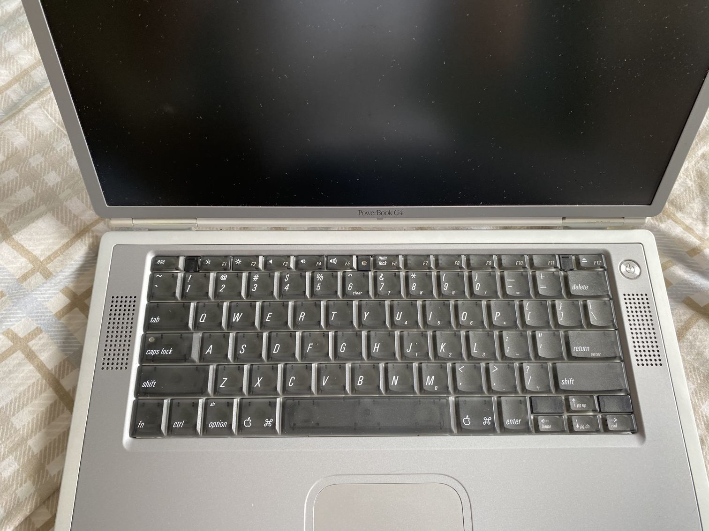
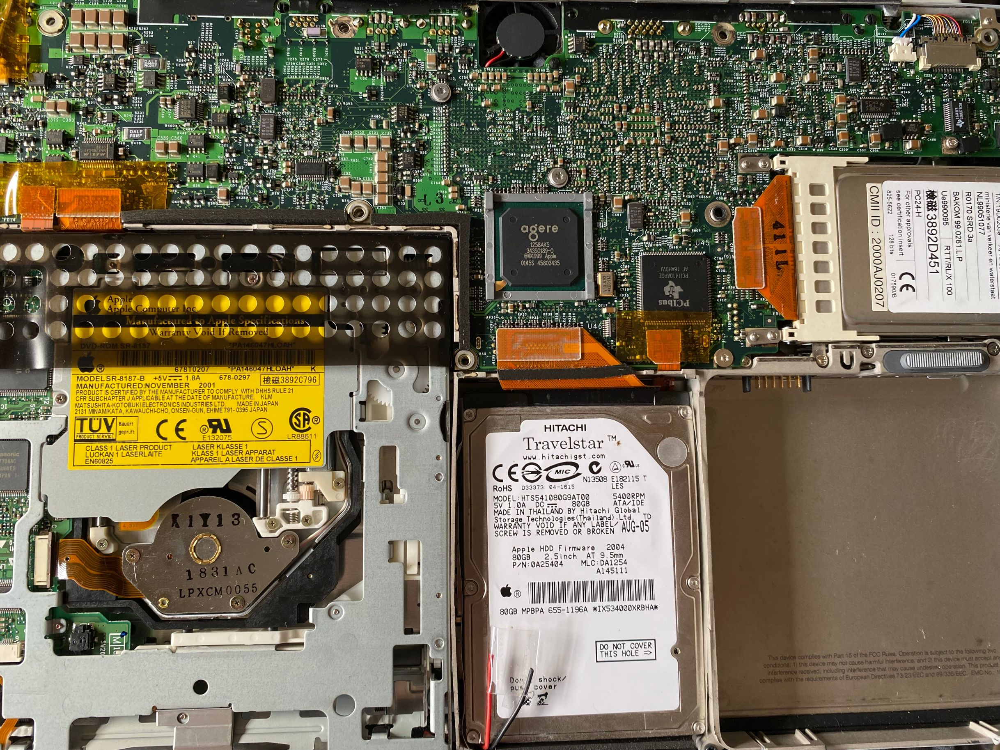

一直想拥有一台ppc构架的计算机，但是一直没有真的买下来过\
虽然中间曾多次~~漫步海鲜市场~~，但也只是浏览

n天前我结识了一只收藏古董硬件的小可爱，经过一番友好的交流，得知他有一台橙色尚可的Powerbook, 遂立刻买入

这台PowerbookG4拥有667Mhz的IBM PowerPC构架中央处理器，ATI Mobility显示卡，512MB DDR，80GB HDD，另外还配备了Airport Card\
(在当时WLAN还是没有推广开的先进技术，属于选配部件

如果把它和发布时间只相差一年的PowerbookG3放在一起，难以相信这是同一个时代的产品

令我惊讶的是2001年出厂的它，历经21年的岁月洗礼，它所配备的锂电池居然还能有2hr的续航时间，没有死掉。\
屏幕上面只有一条划痕， 钛合金的外壳也只有浅浅的几道痕迹\
它的上一任主人一定也是比较爱惜它吧。。。

它的脸大概是酱紫的

我第一眼注意到的是它的边框\
即使是以现在的标准来评判，这样的边框也能称得上窄(后面的铝合金G4还要更窄一些)\
这在当时的笔记型计算机市场一定能惊艳到很多人

半透明的键盘非常有感觉，看起来很漂亮。键程是那个年代的笔记本的标准长度，敲起来有些老ThinkPad的感觉\
按键上面的刻字是倾斜的，是水果的独特味道？

屏幕的转轴是某种塑料材质。。而且是使用螺钉固定在背部的，长时间使用之后很容易发生断裂。。\
上一任主人也特别提醒我打开盖子的时候动作要轻轻的

我觉得Powerbook G4的可维护性做的很好， 如果你想要清理灰尘或者添加记忆体的话，在键盘正面就能直接完成

只需要把键盘最上面的旋钮转180度，再扣住键盘两边的卡扣就可以把键盘拿下来。

值得一提的是键盘背面有磁铁用来让键盘平铺在金属框架上面的时候保持平整

拧下背面的所有六角螺丝就可以取下底壳

那个时候的PCB还不是全黑(好像黑色会增加科技感？)\
散热风扇也不是现代笔记型计算机上常用的涡轮风扇,而使用了轴流风扇

这台PowerBook支援的作业系统版本是MacOS9.2到10.4,跨越了整个从ppc到x86的迁移过程

这次时间仓促，就先拿MacOS9.2.2试试水，等后面有时间折腾光盘了再回来玩。

